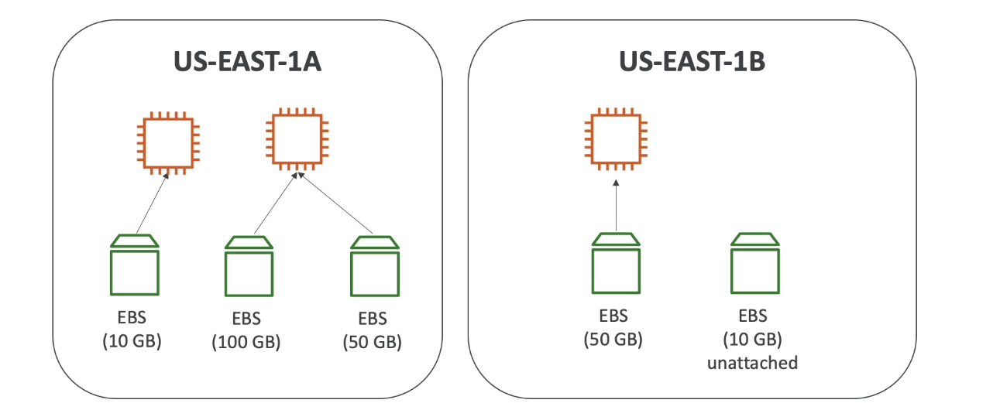

# EBS 
- Stands for Elastic Block Store 
- It is a network drive you can attach to your instance while they run
- It allows your instances to persist data, even after their termination
- They can only be mounted to one instance at a time (at the CCP level)
- They are bound to specific availability zone
- Analogy: Think of them as "network USB Stick"
- Free tier: 30 GB of free EBS storage of type General Purpose (SSD) or Magnetic per month

## EBS Volume 
- It's a network drive (i.e. not a physical drive)
    * It uses the network to communicate the instance, which means there might be a bit  of latency
    * It can be detached from an EC2 instance and attached to another one quickly

- It's locked to an Availability Zone (AZ)
    * AN EBS Volume in us-east-1a cannot be attached to us-east-1b
    * To move a volume across, you first need to snapshot it

- Have a provisioned capacity (size in GBs and IOPS)
    * You get billed for all the provisioned capacity
    * You can increase the capacity of the drive over time. 

## EBS delete on termination
- controls the EBS behaviour when an EC2 instance terminates
    * By default, the root EBS volume is deleted (attribute enabled)
    * By default, any other attached EBS volume is not deleted (attribute disabled)
- This can be controlled by the AWS console/AWS CLI
- Use case: preserve root volume when instance is terminated 

