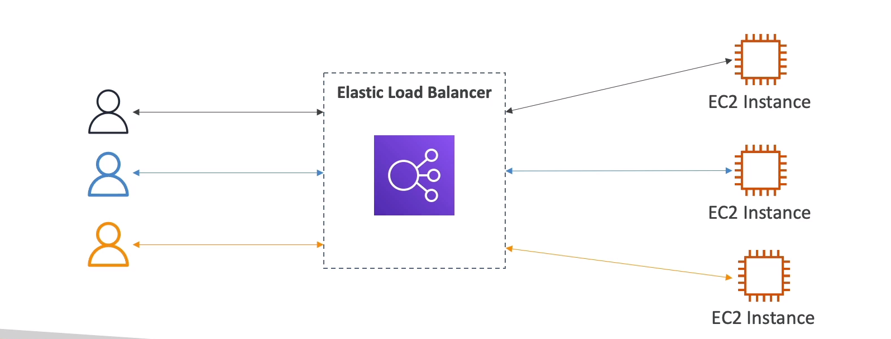
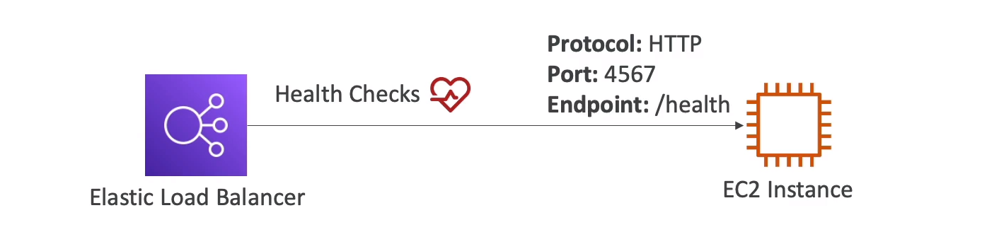
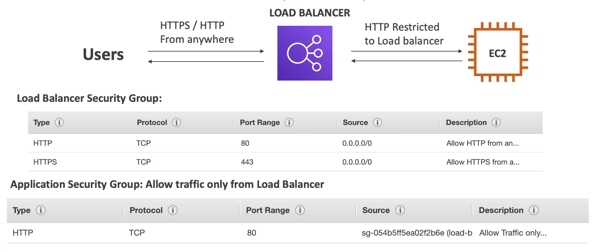

# What is load balancing ?

Load Balances are servers that forward traffic to multiple servers (e.g., EC2 instances) downstream

## Why use a Load Balancer?
- Spread load across multiple downstream instances
- Expose a single point of access (DNS) to your application
- Seamlessly handle failures of downstream instances
- Provide SSL termination (HTTPS) for your websites
- Enforce stickiness with cookies
- High availability across zones
- Separate public traffic from private traffic

## Why use an Elastic Load Balancer?
- An Elastic Load Balancer is a managed load balancer
    * AWS gurantees that it will be working
    * AWS takes care of upgrades,maintenance, high availability
    * AWS provides only a few configuration knobs 
- It costs less to setup your own load balancer but it will be a lot more effort on your end.
- It is integrated with many AWS offerings/Services
    * EC2, EC2 Auto Scaling  Groups, Amazon ECS
    * AWS Certificate Manager (ACM), CloudWatch
    * Route 53, AWS WAF, AWS Global Accelerator

## Health Checks
- Health Checks are crucial for load Balancers
- They enable the load balancer to know if instances it forward traffic to are available to reply to requests
- The health check is done on a port and a route (/health is common)
- If the response is not 200 (OK) , then instance is unhealthy 

## Types of Load Balancer on AWS 
* AWS has 4 kinds of managed Load Balancer
    1. **Classic Load Balancer (v1 - old generation) - 2009 - CLB (Depricated)** 
        - HTTP, HTTPS,TCP,SSL (Seecure TCP)
    2. **Application Load Balancer (v2 - new generation) - 2016 - ALB**
        - HTTP, HTTPS, WebSocket
    3. **Network Load Balancer (V2 - new generation) - 2017 - NLB**
        - TCP, TLS (Secure TCP), UDP
    4. **Gateway Load Balancer - 2020 - GWLB**
        - Operates at layer 3 (Network layer) - IP Protocol

* Overall, it is recommended to use the newer generation load balancers as they provide more features

* Some load balancers can be setup as internal (private) or external (public) ELBs

# Load balancer Security Groups 

