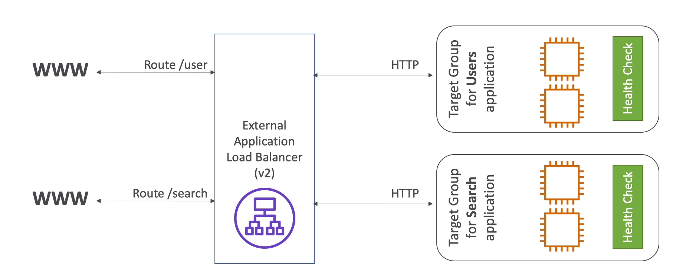
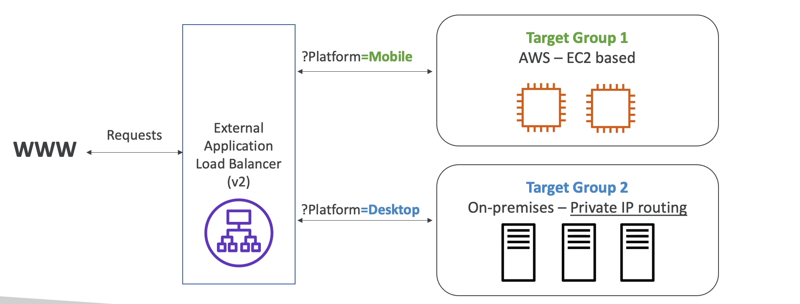

# Application Load Balancer (v2)

* Applocattion load balancers is layer 7 (HTTP)
* Load balancing to multiple HTTP applications across machines (target groups)
* Load balancing to multiple applications on the same machine (ex: containers)
* Support for HTTP/2 and WebSocket
* Support redirects (from HTTP to HTTPS for example)
* Routing tables to different target groups:
    * Routing based on path in URL (example.com/users & example.com/posts)
    * Routing based on hostname in URL (one.example.com & other.example.com)
    * Routing based  on Query string, Headers (example.com/users?id=123&order=false)

* ALB are a great fit for micro services & container-based application (example: Docker & Amazon ECS)
* Has a port mapping feature to redirect to a dynamic port in ECS
* In comparision, we'd need multiple Classic Load Balancer per application

## HTTP based routing

## Target Groups
* EC2 instances (can be managed by Auto Scaling Group) - HTTP
* ECS tasks (managed by ECS itself) - HTTP
* Lambda functions - HTTP request is translated into a JSON event
* IP Address - must be private IPs
* ALB can route to multiple target groups
* Health checks are at the target group level

## Query Strings/Parameters Routing

## ALB Good To Know
- Fixed hastname (XXX.region.elb.amazonaws.com)
- The application servers don't see the IP of client directly
    * The true IP of client is inserted in tthe header X-Forwarded-For
    * We can also get Port (X-Forwarded-Port) and proto (X-Forwarded-Proto)

    