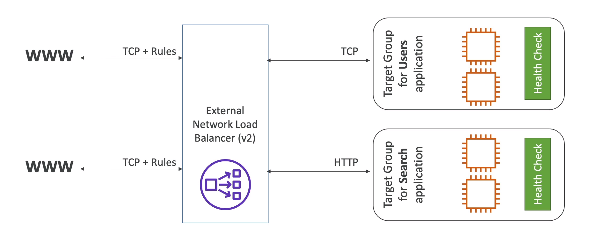
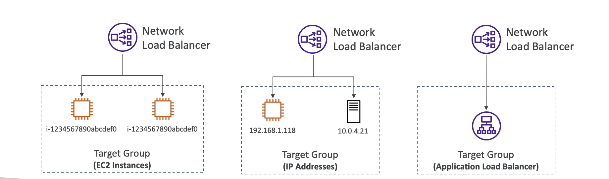

# Network Load Balancer (NLB)

- Network load balancers (layer 4) allow to:
    * Forward TCP & UDP traffic to your instances
    * Handle millions of request per seconds
    * Less latency ~ 100ms (vs 400 ms for ALB)

- NLB has one static IP per AZ, and supports assigining Elastic IP (helpful for whitelisting specific IP)
- NLB are used for extreme performance, TCP or UDP traffic

## Network Load Balancer - Target Groups
- EC2 instances
- IP Addresses - must be private IPs
- Application Load Balancer
- Health Check support the TCP,HTTP and HTTPS protocols 

