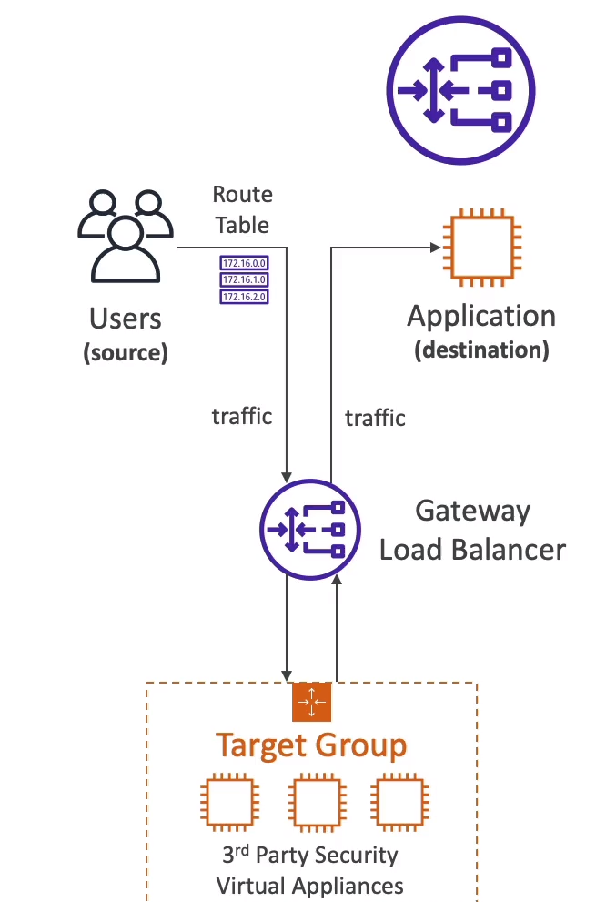
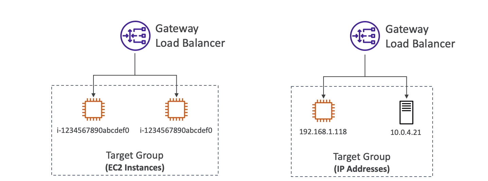

# Gateway Load Balancer

* Deploy, Scale and manage a fleet of 3rd party network virtual appliances in AWS.
* **Example:** Firwalls, Intrusion Detection and Prevention Systems, Deep Packet Inspection Systems, Payload manipulation, ...
* Operates at layer  3 (Network layer) -- IP Packets
* Combines the following functions:
    - **Transparent Network Gateway** :- Single entry/exit for all traffic
    - **Load Balancer** :- Distributes traffic to your virtual appliances 
* Uses teh GENEVE protocol on port 6081 

## Gateway Load balancers Target Group 

- EC2 Instances
- IP Addresses - must be private IPs

