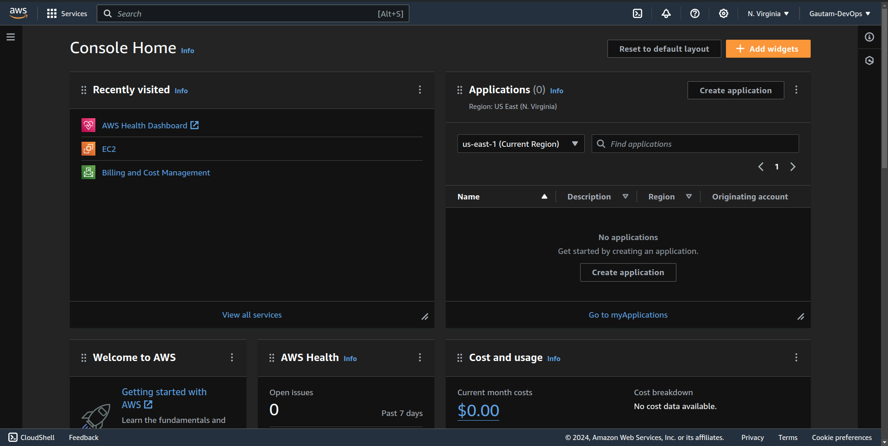
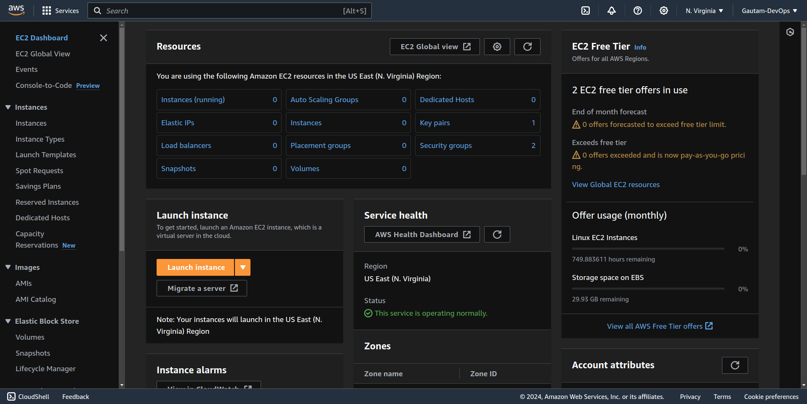
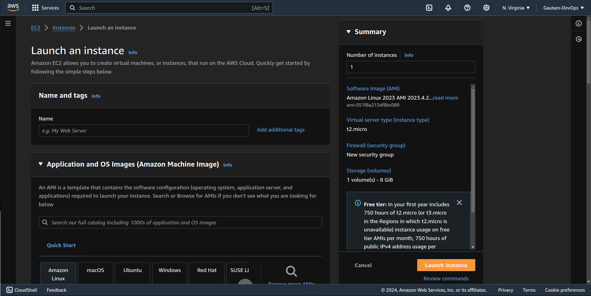
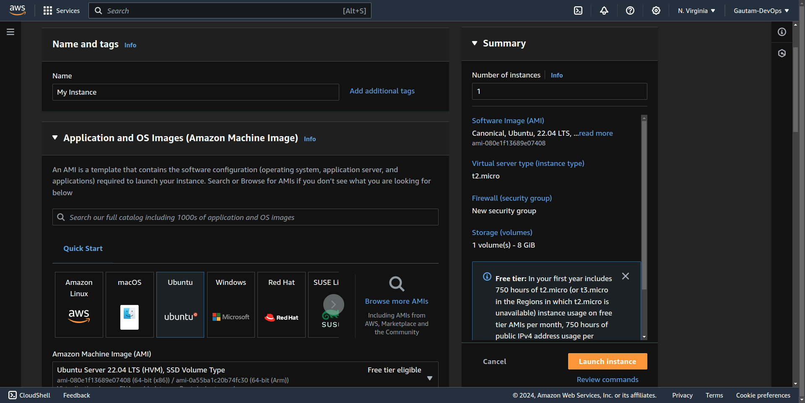
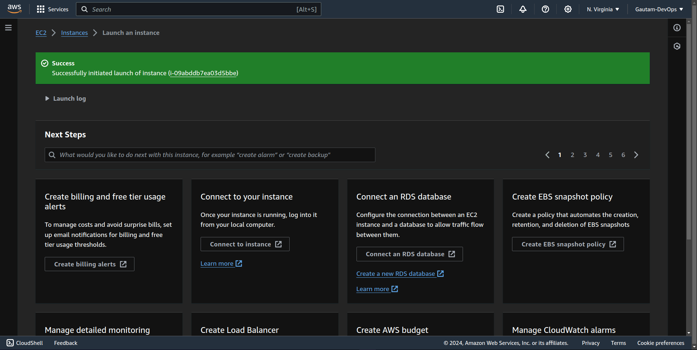
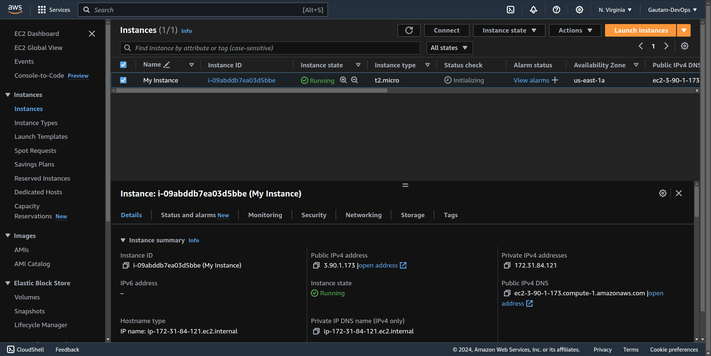
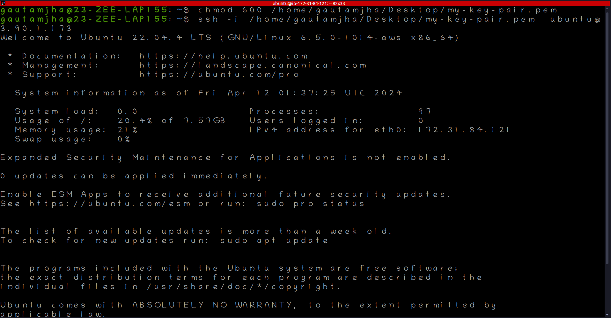
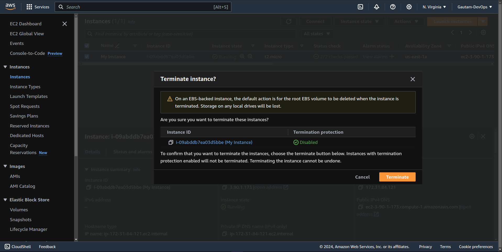

# Project: Create an EC2 Instance

### Overview
This project focuses on launching a virtual server instance using Amazon EC2. Amazon Elastic Compute Cloud (EC2) provides scalable computing capacity in the AWS cloud, allowing users to quickly deploy virtual servers to meet their compute requirements.

### Objective
The main objective of this project is to learn how to provision and manage EC2 instances on AWS. By following the steps outlined in this README file, you'll gain practical experience in launching and configuring virtual servers in the cloud.

## Steps to Launch an EC2 instance 

### Step 1: Navigate to AWS Console
- Log in to the AWS Management Console using your credentials.

### Step 2: Navigate to EC2 Section 

### Step 3: Click on Launch Instance 

### Step 4: Give Instance Name, Select AMI, Select Instance Type, Create/choose key pair, Select Security Group, Configure storage.

### Step 5: Click on Launch Instance

- A success message will pop up when Instance is created 

### Step 6: Access your instance, Go to your instance list and select your instance then copy Public IPv4 address

### Step 7: Access using your terminal, 
- Open Terminal and run this command  `ssh -i <path to your downloded pem key> <user>@<ip_address that you copied on above step>`

- User for Ubuntu machine is `ubuntu`
- User for Amazon Machine is `ec2`

- If you are using Linx or mac to ssh into your instace make sure your pem file has appropriate permission `chmod 600 <path to your pem file>`

> You are now logged into your instance using your terminal 

### Step 8: After Work Done Terminate the Instance 

- On AWS Console, Select the instance your want to terminate 
- Click on Instance State, and then terminate instance.
- Then A pop up window will appear click on Terminate to terminate the Instance 

> Your instance is now terminated 