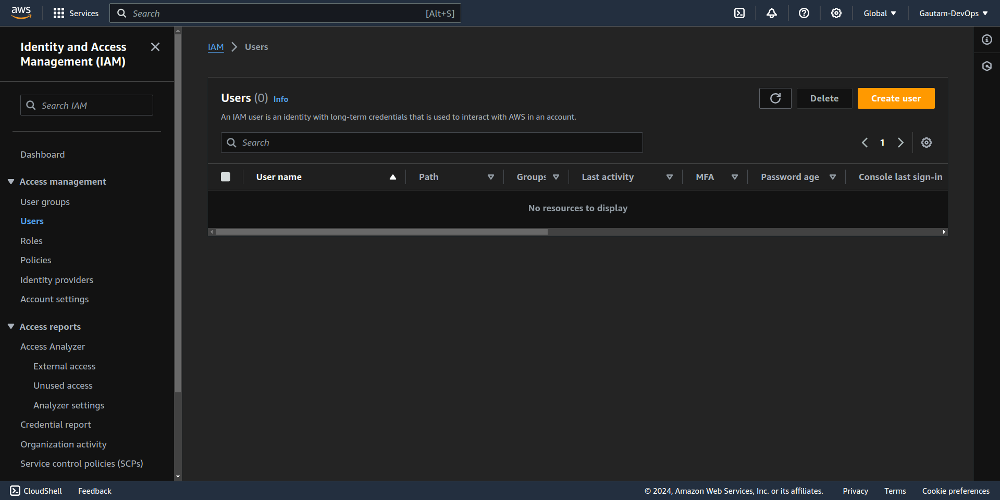
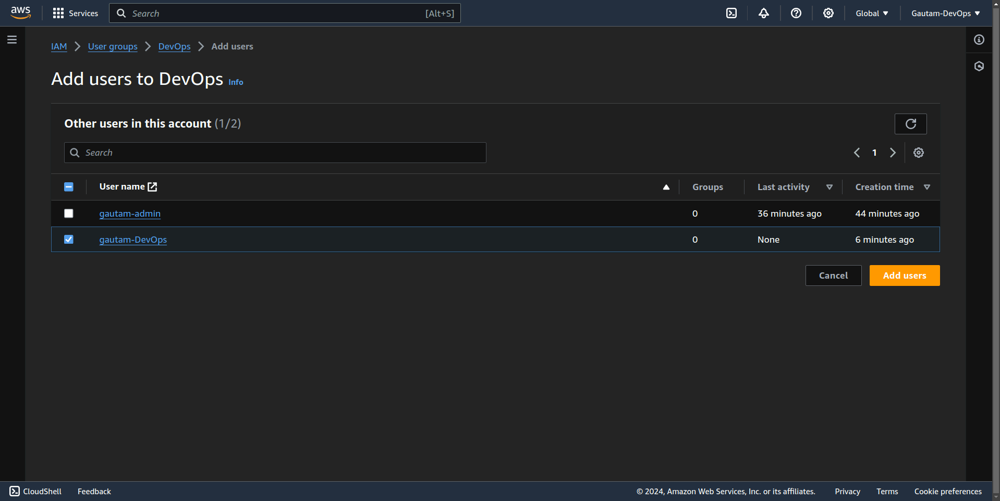

# Project: Set Up IAM Users and Group ~ Create IAM users and groups with appropriate permissions.

## Project Goal

The primary goal of this project is to establish a secure and efficient AWS (Amazon Web Services) environment tailored for DevOps workflows. By leveraging AWS IAM (Identity and Access Management), we aim to provide granular access controls to DevOps team members, allowing them to manage a wide range of AWS resources essential for development, deployment, and operations tasks. Our objective is to implement the principle of least privilege, ensuring that each team member has only the permissions necessary to fulfill their responsibilities effectively. Through this approach, we strive to enhance security, optimize resource utilization, and streamline the management of AWS infrastructure, ultimately contributing to the success and scalability of our project.

## Steps 

### Step 1 : Create a admin user with administrator access 

- Login to the AWS console
- Open IAM Section
- From left hand side section select **users** under **Access management**

- Select create user 
- Give user name, Select the Provide user access to the AWS Management Console - Optional so that user can login TO AWS with console.
-  Select console password, either create a custom password or use Auto generated password. and If you want that user should change it's pasword on it's first loing select checkbox Users must create a new password at next sign-in - Recommended then click next.

- Now click on Attach policies directly
- From permission policies list select AdministratorAccess list 

- click next
- Review the User details and click on Create User

After successful user creation You will get Console Sign-in URL, The username and password to sign in. You will have to save it on a safe place so either download the csv file, Of manually Save everything somewhere in the notpad or something. 

### Step 2 : Create  Group named DevOps
- Open IAM Section
- From Left hand side section select **User groups** unde **Access Management**

-  Click on create Group
- Enter the Name of Group as DevOps

- In Attach permissions policies section, Select some policies for DevOps group members, All the users in this group share the same policies
    * Policies to attach are :-
        - AmazonEC2FullAccess
        - AmazonS3FullAccess
        - AWSLambda_FullAccess
        - AWSCodeDeployFullAccess
        - AWSCodePipeline_FullAccess
        - AmazonRDSReadOnlyAccess
        - AWSIAMReadOnlyAccess
        - AmazonSQSFullAccess
        - AmazonVPCFullAccess
        - AmazonCloudWatchFullAccess

Only 10 policies can be attached with one group

- Then click on create Group

Now you will see out group is created 

### Step 3 : Create a  user again 
- Create a user for DevOps group so that he/she have only access to devops related stuff
- Using Step 1 you can create a user just don't attach permissions to the user

### Step 4 : Add user to group
- Open IAM section
- From Left hand side section select **User groups** unde **Access Management**
- Open The group you want to attach the user 

- From Users in this group section click on Add user button
- Select the user you want to add to the group and click add users

Now the user is added to teh Group

