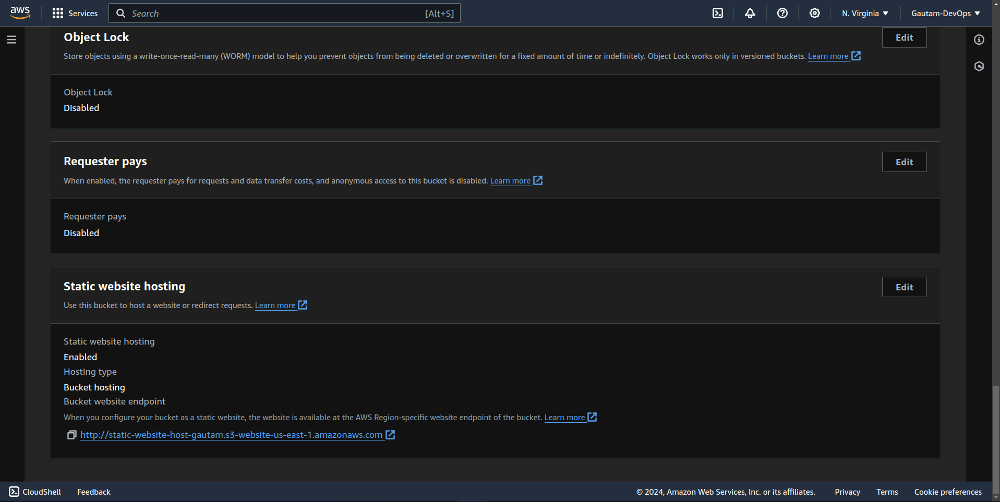

# Project: Host a static Website on S3

## Steps

### Step 1 :- Go to AWS console and on S3 


### Step 2 :- click on Create Bucket 
- Enter name of bucket it should be unique worldwide
- Make it public by unblocking the public access


### Step 3 :- Click on bucket and get inside it


### Step 4 :- Go to properties of bucket and scroll down to static website hosting and click edit


### Step 5 :- Enable Static website hosting


### Step 6 :- After Clicking on enable below that enter the name of file name of index file and error file like 
- index.html for index file
- error.html for error file
- Then click on save changes


### Step 7 :- Move Back to objects section in bucket and upload index.html and error.html file and click on upload


### Step 8 :- Make entire bucket public using Bucket Policy
- Go to permissions tab of bucket
- scroll down to Bucket Policy and click edit 
- Add the bucket policy 

```json
{
    "Version": "2012-10-17",
    "Statement" : [
        {
            "Sid": "PublicReadGetObject",
            "Effect": "Allow",
            "Principal": "*",
            "Action": [
                "s3:GetObject"
            ],
            "Resource": [
                "arn:aws:s3:::BUCKET_NAME/*"
            ]
        }
    ]
}
```

- click on save changes

> don't forget to chage the Bucket arrn in policy json


Policy Updated 


### Access the Website 
- Go to propertiees section of bucket 
- scroll down to Static website hosting
- copy the URL provided



Open The link in browser to access website


