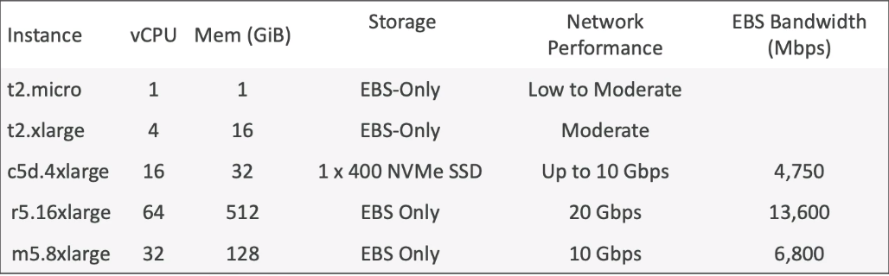

# Amazon EC2
- EC2 is one of the most popula AWS offering. 
- EC2 stands for Elastic Compute Cloud 
- It's AWS Infrastructure as a service offering.
- It mainly consists in the capabilities of 
    * Renting virtual machines (EC2)
    * Storing data on virtual drives (EBS)
    * Distributing load across machines (ELB)
    * Scaling the services using auto-scaling Group (ASG)
- Knowing EC2 is fundamental to understand how the cloud works 

## EC2 sizing and configuration Options to choose from
- Operating System (OS): Linux, Windows or Mac OS
- How much compute power & cores (CPU)
- How much random-access memory (RAM)
- How much storage space
    * Network-attached (EBS & EFS)
    * hardware (EC2 Instance Store)
- Network card: Speed of the card, Public IP address
- Firewall rules: Security group
- Bootstrap script (configure at first launch): EC2 user Data 

## EC2 User Data 
- It is possible to bootstratp our instances using an EC2 User data script.
- bootstrapping means launching commands when a machine starts
- The script is only run once at the instannce first start
- EC2 user data is used to automate boot tasks such as:
    * Installing updates
    * Installing software 
    * Downloading common files from the internet
    * Anything you can think of 
- The Ec2 user Data Script runs with root user

## EC2 instance types: example 

