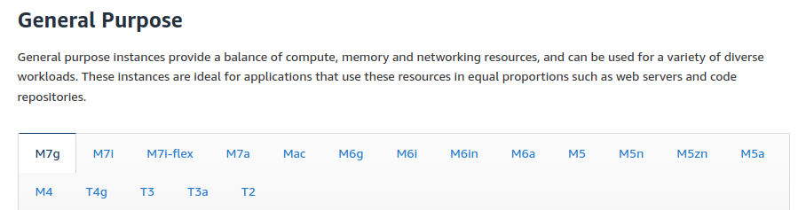
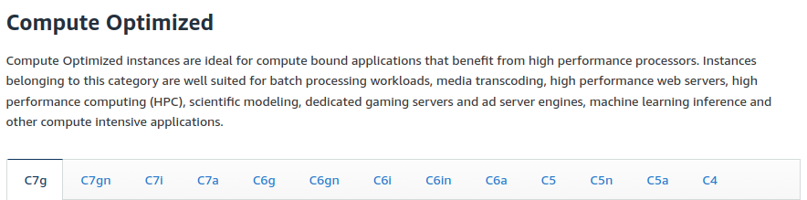
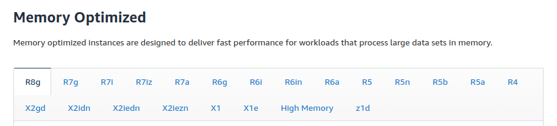
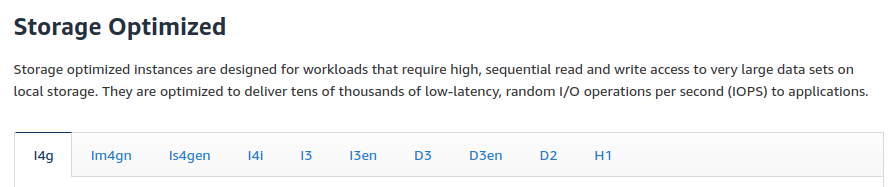

# EC2 Instance Types - Overview

- You can use different types of EC2 instances that are optimized for different use cases. [Read more](https://aws.amazon.com/ec2/instance-types/)
-  AWS has the following naming convention **m5.2xlarge**
    * ***m:** instance class
    * **5:** generation (AWS improves them over time)
    * **2xlarge:** size within the instance class 

## General purpose Instances 
- Great for a diversity of workloads such as web servers or code repositories
- Balance between
    * Compute
    * Memory
    * Networking 

## Compute Optimized Instances 
- Great for compute-intensive tasks that require high performance processors:
    *  Batch processing workloads
    * Media transcoding
    * High performance web serveres
    * High performance computing (HPC)
    * Scientific modeling & machine learning 
    * Dedicated ggaming servers 

## Memory Optimized
- Fast performance for workloads that process large data sets in memory 
- Use cases:
    * High performance, relational/non-relational databases
    * Distributed web scale cache stores
    * In-memory databases optimized for BI (business intelligence)
    * Applications performing real-time processing of big unstructured data.

## Storage Optimized 
- Great for storage-intensive tasks that require high, sequential read and write access to large data sets on local storage.
- Use cases:
    * High frequency online transaction processing (OLTP) system
    * Relational and NoSQL databases
    * Cache for in-memory databases (for example redis)
    * Data ware housing applications
    * Distributed file systems

Want to get info about all the instance checkout [here](https://instances.vantage.sh/)

