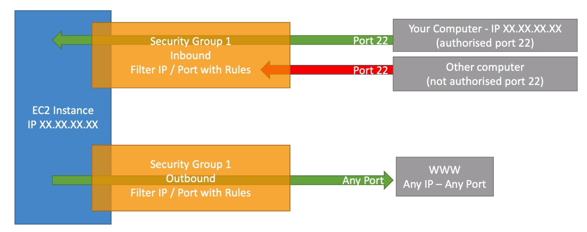
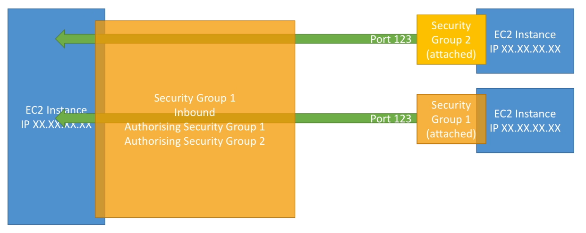

# Intro to Security Groups

- Security Groups are the fundamental of network security in AWS
- They control how traffic is allowed into or out of our EC2 Instances.

- Security groups only contain allow rules
- Security groups rules can reference by IP or by security group. 

## Security Groups Deeper Dive
- Security groups are acting as a *"firewall"* on EC2 instance 
- They regulate:
    * Access to Ports
    * Authorised IP ranges - IPv4 and IPv6 
    * Control of inbound network (from other to instance)
    * Control of outbound network (from the instance to other)

## Security Group Diagram 

## Good to know about Security Group 
-  Can be attached to multiple instances
- Locked down to a region/VPC combination
- Does live **"Outside"** the EC2 - traffic is blocked the EC2 instance won't see it
- It's good to maintain one separate security group for SSH access
- If your application is not accessible (time out), then it's a security group issue.
- If your application gives a **"Connection refused"** error, then it's an application error or it's not launched
- All inbound traffic is blocked by default
- All outbount traffic is authorised by default

## Referencing Other security Groups Diagram 

## Classic Ports to know 
- 22 :- SSH (Secure Shell) - log into a linux instance
- 21 :- FTP (File transfer Protocol) - Upload files into a file share
- 22 :- SFTP (Secure File Transfer Protocol) - Upload files using SSH
- 80 :- HTTP (Hypertext transfer Protocol) - access unsecured website
- 443 :- HTTPS (Hypertext transfer protocol secure) - access secured website
- 3389 :- RDP (Remote Desktop Protocol) :- Log into a Windows Instance

