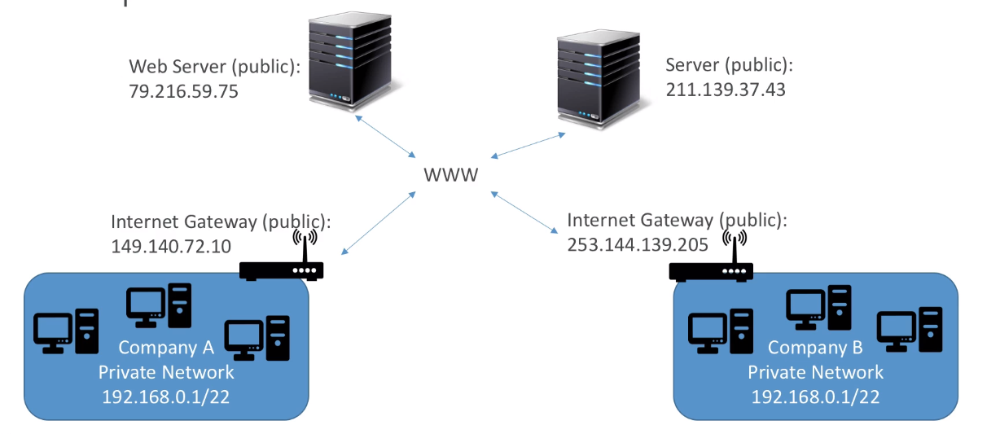

# Privatte vs Public IP (IPv4)

* Networking has two sorts of IPs. IPv4 and IPv6:
    - IPv4: 1.160.10.240
    - IPv6: 2001:0db8:85a3:0000:0000:8a2e:0370:7334

* IPv4 is still the most common format used online
* IPv6 is newer and solves problems for the Internet of Things (IoT)
* IPv4 allows for 3.7 billion different addresses in the public space
* IPv4 : [0-255].[0-255].[0-255].[0-255]

## Private vs Public IP (IPv4) Example 
- With private IP we can communicate to any device withing private network
- With Public IP we are assible over the internet

### Public IP:
- Public IP means the machine can be identified on the internet 
- Must be unique across the whole web(not two machines can have the same public IP)
- Can be geo-located easily

### Private IP:
- Private IP means the machine can only be identified on a private network only
- The IP must be unique across the private network
- But two different private networks can have the same IPs
- Machines connect to Internet (WWW) using NAT + Internet gateway (a proxy)
- Only a specified range of IP can be used as private IPs

# Elastic IP
- When you stop and then start an EC2 instance it can change it's public IP.
- If you need to have a fixed public IP for your instance, you need an elastic IP
- An Elastic IP is a public IPv4 IP you own as long as you don't delete it
- You can attach it to one instance at a time.
- With an Elastic Ip address, you can mask the failure of an instance or software by rapidly remapping the address to another instance in you account 
- You can only have 5 Elastic IP in your account (you can Ask AWS to increase that.)

> Overall try to avoid using public IP:  
    - They often reflect poor architectural decisions  
    - Instead, use a random public IP and register a DNS name to it.  
    - Or use a load balancer and not use public IP at all

