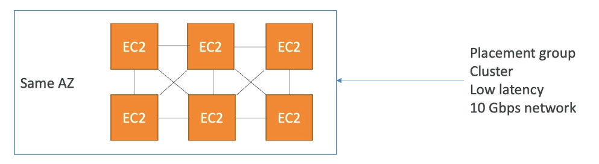
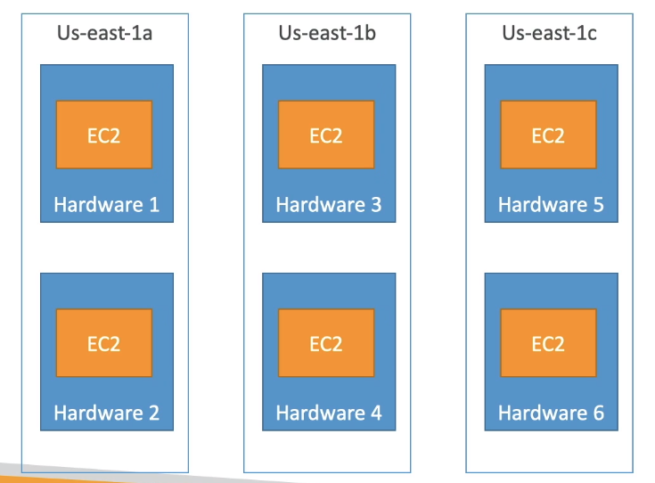
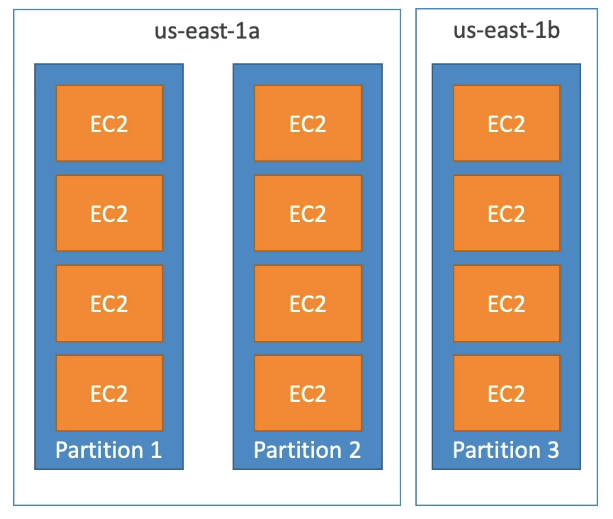

# Placement Group 

- Sometimes you want control over the EC2 Instance placement strategy
- That strategy can be defined using placement groups
- When you create a placement group, you specify one of the following strategies for the group:
    * Cluster :- cluster instances into low-latency group in a single Availability Zone
    * Spred :- spreads instances across underlying hardware (max 7 instance per group per AZ) - critical applications
    * Partition :- spreads instances across many different partitions (which rely on different sets of racks) within an AZ. Scales to 100s of EC2 instances per group (Hadoop, Cassandra, Kafka)

## Cluster placement group 

- **Pros:** Great network (10 Gbps bandwidth between instances with Enhanced Networking enabled - recommended)

- **Cons:** If the AZ fails, all instances fails ate the same time.  
- **Use Cases** 
    * Big Data job that needs to complete fast
    * Application that needs extremely low latency and high network throughput

## Spread Placement Groups

- **Pros** 
    * Can span across Availability Zones (AZ)
    * Reduced risk is simultaneous failure
    * EC2 Instances are on different physical hardware

- **Cons** 
    * Limited to 7 instances per AZ per placement group

- **Use Case**
    * Application that needs to maximize high availability
    * Critical Applications where each instance must be isolated from failure from each other

## Partition grop Placement Group

- Up to 7 partitions per AZ
- Can span across multiple AZs in the same region
- Up to 100s of EC2 instances
- The instances in a partition do not share racks with the instances in the other partitions
- A partition failure can affect many EC2 but won't affect other partitions 
- EC2 instances get access to the partition information as metadata
- **Use Cases** HDFS, HBase, Cassandra, Kafka

