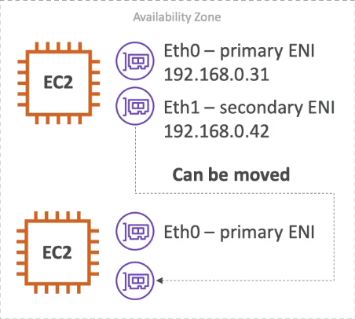

# Elastic Network Interface 

* Logical component in a VPC that represents a virtual network card
* The  ENI can have multiple following attributes:
    - Primary private IPv4, One or more secondary IPv4
    - One Elastice IP (IPv4) per private IPv4
    - One public IPv4
    - One or more security groups
    - A mac Address
* you can create ENI independently and attach them in the fly (move them) on EC2 instances for failover
* Bound to a specific availability zone

