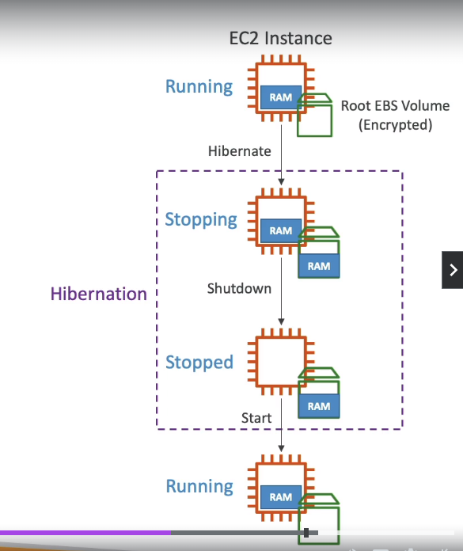

# EC2 Hibernate 

* We know we can stop, terminate instances
    * **Stop** :- Data on disk (EBS) is kept intact in the next start
    * **TErminate** :- any EBS volume (root) also set-up to be destroyed is lost

* On Start, the following process happens:
    * first Start: the OS boots & the EC2 User Data script is run
    * Following Starts: the OS boot up
    * Then your application starts, caches get warmed up, and that can take time!

## Introducing EC2 Hibernate
* The in-memory (RAM) state is preserved 
* The instance boot is much faster! (The OS is not stopped/restarted)
* Under the hood: The RAm state is written to a file  in the root EBS volume
* The root EBS volume must be encrypted

## EBS USe Cases
* Long-running processing
* Saving the RAM state
* Service the take time to initilize

## Good to know about Hibernate 

- Supported Instance Families :- C3, C4, C5, I3, M3, M4, R3, R4, T2, T3, ...
- Instance Ram size :- must be less than 150 GB
- Instance Size :- Not supported for bare metal instances
- AMI :- Amazon Linux 2, Linux AMI, Ubuntu, RHEL, CentOS & Windows...
- Root Volume :- must be EBS, encrypted, not instance storage, and large
- Available for ON-demand, Reserved and spot instances
- An instance can NOT be hibernated more than 60 days

