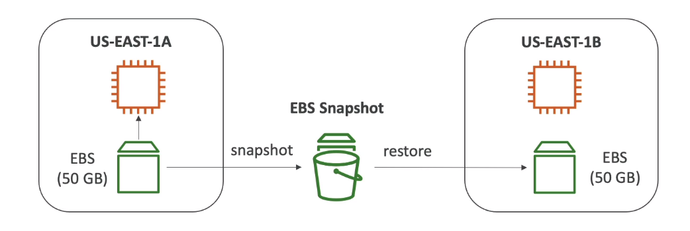

# EBS Snapshot
- Make a backup (snapshot) of your EBS volume at a point in time
- Not necessary to detach volume to do snapshot, but recommended
- Can copy snapshots across AZ or Region

## EBS snapshot feature

- EBS Snapshot Archive
    * Move a Snapshot to an "archive tier" that is 75% cheaper
    * Takes within 24 to 72 hours for restoring the archive
- Recycle Bin for EBS Snapshots
    * Setup rules to retain deleted snapshots so you can recover them after an accidental deletion 
    * Specify retention (from 1 day to 1 year)
- Fast Snapshot Restore (FSR)
    * Force full initilization of snapshot to have no latency on the first use (will cost you $$$)

    