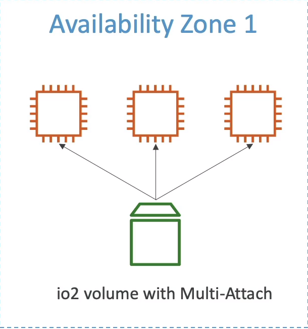

# EBS Multi attach --- io1/io2 family
* Attach the same EBS volume to multiple EC2 instances in the same AZ
* Each instance has full read & write permissions to the high-performance volume
* Use case:
    - Achieve higher application availability in clustered Linux applications (ex: teradata)
    - Appplications must manage concurrent write operations
* Up to 16 EC2 Instance at a time
* Must use a file system that's cluster-aware (not XFS,EXT4,etc.)

