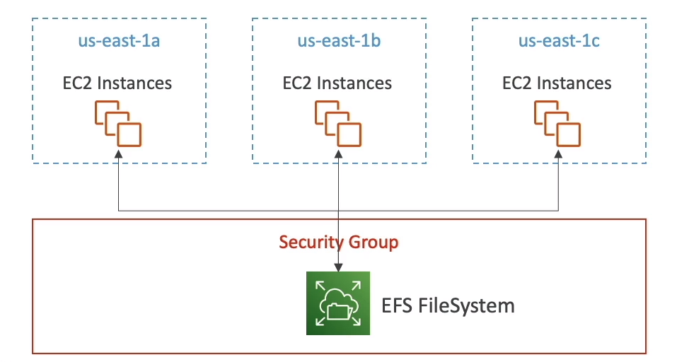
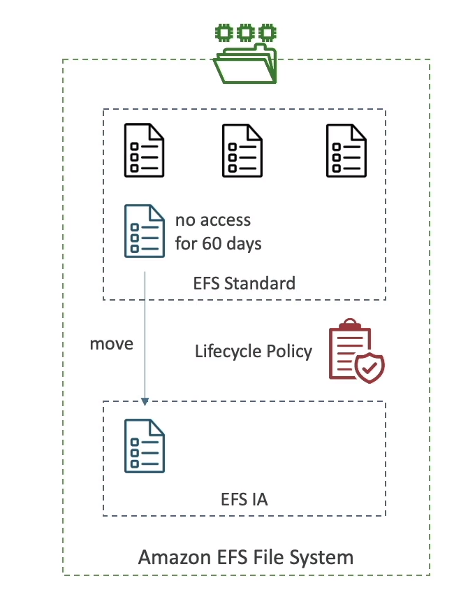

# Amazon EFS (Elastic File System)

- Managed NFS (network file system) that can be mounted on many EC2
- EFS works with EC2 instances in multi-AZ
- Highly available, scalable, expensive (3x gp2), pay per use

## Use Cases
- Content  management, web serving, data sharing, Wordpress
- Uses NFSv4.1 protocol
- Uses security group to control access to EFS
- Compatible with Linux based AMI (Not Windows)
- Encryption at rest using KMS

- POSIX file system (~Linux) that has a standard file API
- File system scales automatically, pay-per-use, no capacity planning!

## EFS Performance 

- **EFS Scale**
    * 1000s of concurrect NFS clients, 10 GB+/s throughput
    * Grow to petabyte-scale network file system automatically
- **Performance Mode (set at EFS creation time)**
    * General Purpose (default) :- Latency-sensitive use cases (web server, CMS, etc...)
    * Max I/O :- higher latencty, throughput, highly parallel (big data, media processing)
- **Throughput Mode**
    * Brusting L0 1TB = 50MiB/s + brust of up to 100MiB/s
    * Provisioned :- Set your throughput regardless of storage size, ex: 1 GiB/s for 1TB storage
    * Elastic :- automatically scales throughput up or down based on your workloads
        - Up to 3GiB/s for reads and 1GiB/s for writes
        - Used for Unpredictable workloads

## Storage Classes
- **Storage Tiers (lifecycle managemennt feature - move file after N days)**
    * Regional: for frequently accessed files
    * Infrequent access (EFS-IA): Cost to retrieve files, lower price to store. Enable EFS-IA with a Lifecyle policy
- **Availabiility and Durability**
    * Regional: Multi-AZ, great for prod
    * One Zone: One AZ, great for dev, backup enabled by default, compatible with IA (EFS One Zone-IA)
- Over 90% in cost savings

